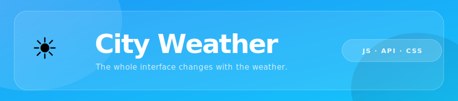

<div align="center">



</div>

---

## The idea

I built this to answer a question that was bothering me: how do you get weather data for a city when the weather API speaks coordinates, not words?

Open-Meteo is free and accurate, but it wants latitude and longitude. Users type "Porto" or "Tokyo" or wherever they are. So there's a step in the middle: a geocoding call converts the name into coordinates, and only after that resolves can the weather request go out. Two APIs, two fetches, one depending on the other.

Chaining those requests without async/await, using plain `.then()` promises, is what this project was really about. Getting the sequence right. Handling what happens when either step fails. Making it feel instant to the user even though there are two network round-trips happening.

The UI was secondary at first. Then it became the part I ended up caring most about.

---

## How it works

```
User types a city
       ↓
Geocoding API → returns lat, lon, real city name
       ↓
Weather API (lat + lon) → returns temperature, wind speed, weather code
       ↓
Weather code → emoji + background state
       ↓
UI updates entirely
```

Weather codes map to four visual states: clear sky, cloudy, rain, and snow. Each state changes the background gradient, the card tone, and the button colour. Snow is the outlier: it's the only state where the palette flips to near-white and the text goes dark.

Loading and error states are both handled. If the city isn't found or the network fails, the UI says so without breaking.

---

## What changes with the weather

| State | Background |
|-------|-----------|
| ☀️ Clear | Sky blue → electric cyan |
| ☁️ Cloudy | Slate grey → dark slate |
| 🌧️ Rain / ⛈️ Storm | Deep navy |
| ❄️ Snow | Near-white blue-grey (text inverts to dark) |

The frosted glass card floats on top of whatever gradient is behind it. The `backdrop-filter: blur(25px)` pulls the background colours through the card surface, which means the card always looks right, regardless of which state you're in.

---

## Stack

- HTML5
- CSS3: backdrop-filter, gradient transitions, keyframe animations, pseudo-element blobs
- Vanilla JavaScript: Fetch API, Promise chaining with `.then()`
- [Open-Meteo Geocoding API](https://open-meteo.com/en/docs/geocoding-api): city name → coordinates
- [Open-Meteo Forecast API](https://open-meteo.com/en/docs): coordinates → weather data
- Satoshi (self-hosted variable font)
- No frameworks. No build step.

---

## Run it locally

```bash
git clone https://github.com/bytiagodev/weather-app-js.git
cd weather-app-js
# Open index.html in a browser. No server required.
```

No API keys needed. Both Open-Meteo endpoints are free and open.

---

<div align="center">

**[Live Demo](https://bytiagodev.github.io/city-weather/)** · **[bytiago.com](https://bytiago.com)**

</div>
